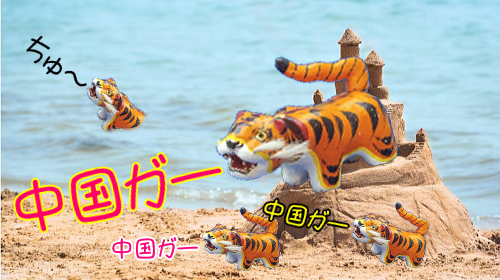
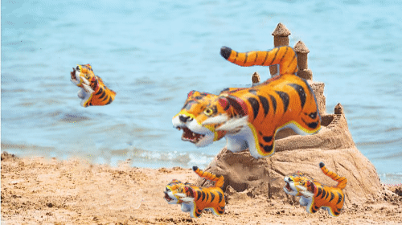

# 中国ガー

元のイメージ

FcRRmR6agAAx4WX.png

Windows付属ソフト ペイント3Dの『マジック選択』で一つ一つ切り抜いて行き  
不自然な部分を GIMP を使い手作業で修正しました

ga.xcf

Krita は GIMP のファイルを読み込めないので、フォトショップ形式でエクスポート

FcRRmR6agAAx4WX.psd

それを Krita で読み込み動きをつけました

